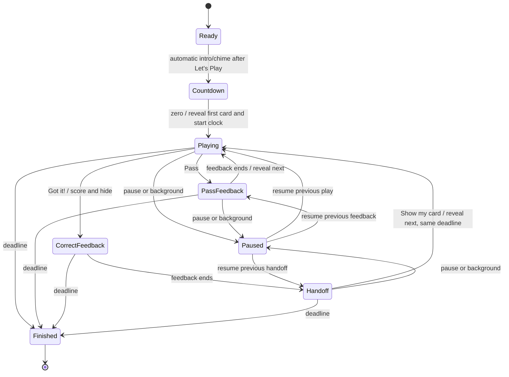

# Pass n' Play master plan

Date: October 1, 2026

Status: Implementation started on `codex/pass-n-play`. Core round flow and mode selection integrated; visual/device verification and group playtesting pending.

## Implementation progress

October 1, 2026 — Chunk 1: added mode configuration with Classic as the default, a handoff phase that freezes remaining time, recipient reveal that resumes the clock, handoff-aware pause/resume, and deadline guards for late answers and stale expiry callbacks. Added reducer tests covering these rules. The new transitions are not yet wired into the round provider or screens.

October 1, 2026 — Chunk 2: added mode-aware provider configuration, recipient reveal and deadline-specific expiry actions, and accepted-transition card-memory decisions. Pass n' Play recording preparation/start/resume are disabled. Result snapshots carry optional mode metadata while remaining compatible with version-1 recordings. Current-round replay preserves mode, and archived replay forwards a normalized mode to deck setup. The setup screen will consume that parameter when the selector is implemented. Validation: all 274 tests passed, typecheck passed, and lint passed for the changed files.

October 1, 2026 — Chunk 3: separated Classic ready presentation into its own component and added a dedicated portrait Pass n' Play ready screen. Explicit readiness starts the get-ready beat followed by 3–2–1, with optional existing sounds/haptics. The ready timeline preserves exact remaining time through background interruptions, ignores stale callbacks, and supports cancellation with Android back handling. The route mounts only the selected mode's ready component. Validation: all 280 tests passed, typecheck passed, and lint passed for this chunk. Physical-device layout/audio verification remains pending.

October 1, 2026 — Chunk 4: separated Classic game presentation and added the portrait answer, pass feedback, hidden-card handoff, and explicit pause/resume flow. The round freezes on Got it! and reveals/resumes on Show my card; backgrounding requires an explicit Resume. Extracted the existing portrait Time's Up panel for both modes, with the existing end beat before results. Added tests for secret-content visibility, ending from pause, and expiry winning over pause. Validation: all 285 tests passed, typecheck passed, and lint passed for this chunk. The presentation tests verify rendered content, not native layout. Physical-device layout, touch, and audio verification remains pending.

October 1, 2026 — Chunk 5: added responsive Classic/Pass n' Play blocks on deck details with accessible selected states, remembered mode selection, and explicit replay/cancellation mode restoration. Selection stacks on narrow screens or at larger text sizes. Pass n' Play skips setup permission requests and Classic-specific permission notices. Results identify the mode and group score. Preference writes are ordered so rapid changes cannot restore the wrong choice. Setup waits for mode hydration and rejects duplicate start input. Validation: all 292 tests passed, typecheck passed, and lint passed for this chunk.

October 1, 2026 — Chunk 6: added a complete-round integration scenario covering a skip, a correct guess, interrupted handoff, interrupted active play, stale expiry, final results, and clean replay configuration. The scenario verifies exact accumulated time and remembers only revealed cards. Validation: all 293 tests passed, typecheck passed, and full lint completed with zero errors and four existing warnings in generated router types and the live-overlay module. Metro compiled the web client and server bundles successfully. Browser automation repeatedly timed out, so no visual or interactive browser checks are claimed. Added the hands-on verification script below.

October 1, 2026 — Development-build preparation: updated the eight packages flagged by Expo's SDK 57 compatibility check, including Expo 57.0.26 and Router 57.0.24, and applied reviewed non-forced npm audit patches to transitive dependencies. Package manifests and lockfile are updated. Expo Doctor passes 21/21 checks, Expo install reports compatible versions, npm's direct dependency tree is valid, typecheck and all 293 tests pass, and iOS/Android bundle export succeeds. Full lint has zero errors and four existing warnings. The development EAS profile enables the development client and internal distribution; app config resolves with the linked EAS project. No native build was submitted. A fresh development build is now appropriate to include the native SDK patches. The user will perform physical-phone testing.

Dependency follow-up: npm audit still reports 15 findings (14 moderate, one high), including inherited package findings. Prioritize Metro's image-size 1.2.1 high-severity advisory: patched 2.x requires a compatibility review before an override. The other chains involve Router → query-string → decode-uri-component and Expo config plugins → xcode → uuid. Forced npm fixes propose incompatible Router/Splash Screen downgrades; do not apply them. Review upstream fixes or targeted overrides separately. Optional camera/IAP and major framework updates require their own regression testing. Doctor success and bundle export do not confirm native compilation or physical-device behavior.

October 1, 2026 — Phone-test refinements: simplified the setup selector and moved it below LET'S PLAY. Matched Pass n' Play's active border, correct/pass fills, ready background, and portrait Time's Up frame spacing to Classic. Removed explanatory instructions from ready, countdown, active play, handoff, pause, and pass feedback. Ready uses a white button with blue text, and deck titles are uppercase. Fixed cancellation's mode-switch race by keeping the ready route's mounted mode stable through RESET; X and Android back return to deck details with the existing rightward screenshot slide. Added cancellation and instruction-removal regression checks. Validation: 295 tests pass, typecheck passes, and changed-file lint passes. Slide feel and native layouts need confirmation on the user's phone.

October 1, 2026 — Continuous-clock revision: the user changed the handoff policy to keep time running. Both answers now show brief full-screen Classic-style feedback (PASS/× or CORRECT!/checkmark); correct feedback leads to a white handoff card. Show my card is large and centered. The active X opens an end-round prompt while the timer continues. Background interruption still pauses and covers the card until explicit Resume. Handoff expiry and late reveal finish without counting an unseen card. The centered I'M READY button has no redundant heading; the following intro says HERE WE GO, then 3–2–1. Pass n' Play bylines are slightly larger. Earlier frozen-handoff progress notes describe the superseded implementation.

Latest ready-flow revision: LET'S PLAY opens GET READY and automatically plays the existing intro chime, then 3–2–1. The user removed the explicit I'M READY step and reverted HERE WE GO to GET READY. Keep the final countdown frame while navigation completes and start the round before the game screen's first paint to avoid flashing the intro or waiting card before the first answer.

Next chunk: run the hands-on script through the app and fix any observed layout or interaction issues. Native touch/audio verification and a physical group playtest remain necessary before treating the feature as release-ready.

### Hands-on verification script

Run on iOS and Android development builds, plus web for manual controls. Record platform, device, text size, result, and any issue beside each check. These checks remain pending.

1. Open deck details. Check both descriptions, selected states, round-length selection, and the start button on a small phone. Increase system text size and confirm the mode blocks stack and the page scrolls without clipped copy.
2. Choose Pass n' Play. Start with motion, camera, and microphone permissions denied. Confirm LET'S PLAY → GET READY/chime → 3–2–1 → first answer, all in portrait, with no extra screen flashing after countdown. Confirm round time begins at the answer reveal.
3. Tap Pass. Confirm one skip, full-screen PASS/× feedback, then a new answer while the clock continues. Try repeated rapid taps and confirm no extra skips.
4. Tap Got it! at a known clock value. Confirm the answer and byline disappear, one correct result is recorded, and full-screen CORRECT!/checkmark feedback leads to a white Pass the phone card. Time continues; Show my card reveals once without extending the deadline. Try double taps and finger drags across the transition; check for accidental reveals. Let time expire during handoff and check that no unseen card is added to results.
5. Background during ready, countdown, active play, feedback, and handoff. Return and confirm the answer stays covered until explicit continuation. A resumed handoff must still require Show my card. Use X or Android back during play and confirm the end-round prompt appears while time continues.
6. Let time expire during active play and during Pass feedback. Try tapping at expiry. Confirm Time's Up → results, no late score, and no unseen answer in results. End manually from paused play and paused handoff, checking the unanswered result appears only for the revealed active card.
7. Replay from results. Confirm Pass n' Play, the same duration, and a clean score. Return to deck details, switch to Classic, restart the app, and confirm the choice is remembered. Check an older saved round still replays as Classic.
8. Try a one-card deck and a long answer/byline. Check replenishment and scrolling. Mute audio and enable reduced motion, then complete several physical handoffs with a group using only the in-app instructions.
9. Play a Classic round, including tilt/forehead readiness, manual fallback, recording, pause, and Time's Up. Record any regression separately.

## 1. Feature goal

Let a group play the existing decks with one person holding the phone, reading a card privately, and giving clues to everyone else. After a correct guess, the phone moves to the next clue giver. The entire round uses a portrait interface.

The deck details screen offers two modes:

| Classic | Pass n' Play |
| --- | --- |
| One guesser, multiple clue-givers | Multiple guessers, one clue-giver |
| Hold the phone at your forehead | Hold the phone facing you |

Both modes use the same deck content, access rules, and round-length picker.

### Requested requirements

- Two selectable mode blocks on deck details, side by side where space allows.
- Portrait Get Ready, 3–2–1, and answer-card screens for Pass n' Play.
- Reveal the first card when the initial countdown reaches zero.
- A Pass button lets the current clue giver skip cards without handing over the phone.
- A correct guess gives the group time to pass the phone before revealing another card.
- Reuse the existing portrait Time's Up design.

### Recommended defaults to validate

- Use an explicit hidden-card handoff with a reveal button for the next player.
- Keep the timer running through feedback and the phone handoff. The user revised the earlier pause decision during phone testing on October 1, 2026.
- Score the group together; no player setup or team assignment in the first release.
- Allow unlimited passes with no score deduction; time spent choosing is the tradeoff.
- Support optional portrait video recording and save the recording with its results to My Rounds. Camera-based handoff detection remains outside this feature.
- Default new installations to Classic; remember the last selected mode. Replay preserves the completed round's mode.

## 2. Recommended handoff

**Got it! → CORRECT! → Pass the phone → Show my card**

1. The clue giver sees the current answer and gives clues.
2. If the group guesses it, the clue giver taps **Got it!**.
3. The answer disappears immediately. The round records one correct answer.
4. Brief full-screen CORRECT! feedback leads to a white handoff card titled **Pass the phone**. The timer keeps running.
5. The next player taps **Show my card** to reveal the next answer.
6. That player becomes the clue giver. Repeat until time expires.

This gives the recipient control over when the next answer appears. There is no repeated 3–2–1 between players and no fixed waiting period.

Keep the answer controls and brief PASS state without explanatory instructions, as requested during phone testing. The handoff title and Show my card button identify the next action.

### Alternatives considered

| Approach | Benefit | Tradeoff | Recommendation |
| --- | --- | --- | --- |
| Hidden handoff + recipient reveal | Flexible passing speed; clear scoring moment; no permissions | Two taps across two players | First release |
| Recipient taps “Next turn” on the old answer | Only one tap per successful turn | Old answer remains visible; scoring and passing are ambiguous | Optional prototype for comparison |
| Automatic reveal after a short timer | No recipient tap | Can reveal while the phone is still moving or make quick groups wait | Avoid as the default |
| Detect a new face | Potentially hands-free | Requires separate feasibility work and reliable fallback | Later experiment |
| Hold to reveal | Card can remain hidden while the phone moves | Continuous touch adds fatigue and accessibility friction | Consider only if playtests expose a need |

Camera availability alone does not establish that a different person is holding the phone. Occlusion, multiple faces, changing angles, and the same person looking away all need evaluation. The project currently uses Vision Camera; Expo Camera documentation is not evidence of a ready-made person-change detector in this app. Any future prototype must retain manual reveal, work when permission is denied, and measure false reveals before becoming an option.

## 3. Screen and copy specification

### Deck details

Place the two compact mode options below LET'S PLAY in the footer, without a HOW TO PLAY heading. Each option contains only its mode name, with one short selected-mode description below the options. Use a selected border/background and accessible selected state, with no radio indicator or checkmark. The entire option is tappable. The user requested this simpler layout during phone testing. Keep the original deck header dimensions and title sizing, with no extra bottom footer padding beyond the safe-area inset.

- Below the options, show one short description for the selected mode.
- **Classic:** “One guesser, multiple clue-givers.”
- **Pass n' Play:** “Multiple guessers, one clue-giver.”

Use two equal-width columns when both descriptions fit comfortably. Stack vertically on narrow screens or at larger text sizes. Preserve the visible start action and allow the setup content to scroll. Freeze selection while starting a round.

### Portrait Get Ready

- Display **GET READY** immediately after LET'S PLAY, then automatically continue to countdown.
- No separate readiness button.
- Upper-right deck title in capitals; no instruction copy.
- Use Classic's blue background and cyan border.

Use the familiar get-ready chime/beat and initial countdown automatically. LET'S PLAY is the readiness action. Time on this screen does not consume round time.

### Portrait countdown

Use a large centered **3**, **2**, **1** and the deck identity without instruction copy. Reuse existing countdown sounds and appropriate haptics. Reveal the first card at zero and start the round clock once, as part of that transition.

### Portrait answer card

- Top: remaining time and a clearly separated X control for the end-round prompt.
- Center: deck-styled answer card with large, wrapping text and optional byline.
- Bottom: secondary **Pass** and primary **Got it!** actions, comfortably reachable with either hand.
- No explanatory instruction copy around the controls.

Use the current theme, deck identity, and answer typography as the visual starting point. Design for long answers and large text rather than rotating the landscape card. Avoid full-screen tap targets that trigger during a grip change. Keep controls at least 48 logical pixels high, with space between them.

### Portrait handoff

- Preceded by full-screen **CORRECT!** feedback with a checkmark.
- Main instruction: **Pass the phone**.
- Large centered primary button: **Show my card**.
- Timer stays visible and continues counting down; no Timer paused label.

Remove answer content from the visible and accessibility trees during handoff. Do not announce or preload the next answer into accessible text. Position the reveal action differently from Got it! and require a fresh touch after the previous touch ends. Add only a short input guard if physical testing shows accidental double taps; do not turn it into a mandatory handoff countdown.

### Time's Up and results

Reuse the existing portrait Time's Up visual, including the established audio/end beat. Make its completion flow work without recording. Results show the mode, group correct count, passed cards, and any actually revealed unanswered card. **Play again** retains deck, duration, and mode.

The current portrait end design lives inside the game screen's portrait-pause branches, so reuse may require extracting its presentation from that lifecycle.

## 4. Round rules and edge cases

| Event | Expected behavior |
| --- | --- |
| Pass | Record one passed answer; brief feedback; show the next card to the same holder |
| Got it! | Record one correct answer; hide it; show full-screen feedback then handoff without revealing another card; keep time running |
| Show my card | Advance/reveal once without changing the deadline |
| Time expires on an answer | Hide answer; record it as unanswered; show Time's Up |
| Handoff begins with no remaining time | Show Time's Up instead; do not create an unanswered result for an unseen card |
| Time expires during pass feedback | Keep the passed result; do not reveal another card |
| Repeated or stale taps | Ignore invalid transitions and duplicate actions |
| Action arrives at/after deadline | Expiry wins; do not add a late correct/pass or reveal |
| Manual pause or app background | Hide card, freeze remaining time, remember the exact phase |
| Resume from a visible card | Keep a cover until explicit Resume; reveal the same answer and resume time together |
| Resume from handoff | Return to handoff; recipient must still tap Show my card |
| Resume from pass feedback | Complete the pending pass transition once, with no duplicate result |
| Phone is tilted or turned sideways | Keep portrait presentation; do not score or pause based on posture |
| Empty/unavailable deck | Prevent start and show a useful message |
| Card pool is exhausted | Follow the existing replenishment policy; finish cleanly if no card is available |
| Exit during setup/round | Cancel pending work; use existing exit conventions; never navigate later from a stale callback |

Use one group score: +1 per correct answer, no penalty for Pass, and no named players or turn ownership to maintain. Use existing duration choices initially.

Keep time running from Got it! through feedback and handoff until Show my card. A slow handoff consumes round time, and expiry can finish the round during handoff. Card-skipping with Pass also consumes time. Use this behavior without a timer-policy setup toggle.

The app can hide answers during transitions, but players still need to keep the screen facing the clue giver during active play. Screen-reader users should use private audio where needed; announce interface state without automatically speaking secret answers to the room.

## 5. Current implementation findings

Reviewed against the repository on October 1, 2026:

| Area | Existing behavior and planned change |
| --- | --- |
| `src/app/deck/[deckId].tsx` | Owns duration, permission requests, configureRound, and ready navigation. Add mode choice and mode-specific setup. |
| `src/app/ready.tsx` | Combines forehead detection, sound/recording preparation, countdown, and landscape presentation. Separate mode-specific readiness and presentation. |
| `src/app/game.tsx` | Owns tilt input, feedback, posture pause, timer, recording, and end flow. Keep Classic behavior in a dedicated component and add a portrait Pass n' Play component. |
| `src/app/_layout.tsx` | Ready/game routes already specify portrait. Review transition behavior; a global orientation redesign is unnecessary. |
| `src/components/landscape-viewport.tsx` | Rotates Classic content 90 degrees on native. Pass n' Play must bypass this wrapper. |
| `src/game/game-types.ts`, `game-reducer.ts` | Have playing/feedback/paused/finished, but no mode or handoff phase. Extend transitions explicitly. |
| `src/game/round-context.tsx` | Owns configuration, deck snapshot, card memory, advancement, and recording. Carry mode through all entry points and gate mode-specific side effects. |
| `src/game/round-result-snapshot.ts` | Snapshot version 1 has no mode. Add backward-compatible mode metadata and update readers/validators. |
| `src/app/results.tsx` | Current replay configures only deck and duration; archived replay routes through deck details. Both paths need mode preservation. |
| `src/storage/preferences.ts` | Existing preference pattern can hold last selected mode. |
| `src/storage/daily-card-memory.ts` | Shared content memory and replenishment can serve both modes. Remember cards when actually revealed. |
| `src/hooks/use-round-timer.ts` | Existing deadline-based timer is reusable; keep the same deadline through feedback and handoff. |

Two specific integration risks: the reducer currently advances feedback on resume, and Classic's manual feedback effect advances automatically. Neither behavior should accidentally reveal a card during handoff.

## 6. Technical design

### Mode and state

Add a `GameMode` value such as `classic | pass-n-play` to round configuration and state. Existing callers and stored records without mode resolve to Classic. Validate values from route parameters and storage.

Add a distinct `handoff` active phase and an explicit reveal/continue action. Keep the answered card index during handoff; advance only when the recipient reveals. This makes it easier to avoid counting or remembering an unseen card.

Suggested transition model:

Ready/countdown may remain screen-level phases as they are today; the diagram describes behavior, not a requirement to move every phase into the reducer.

Reducer guards must enforce mode, phase, and deadline, including for delayed reveal/advance callbacks. Pass the action timestamp where required. Side effects such as card memory and sounds should follow accepted transitions so rejected inputs cannot remember unseen cards or play success cues. Cancel stale feedback/countdown work on pause, exit, and finish.

Keep the deadline unchanged when Got it! is accepted and when Show my card reveals. Expiry during correct feedback or handoff must finish without revealing or recording a new card. Background pause freezes time and restores a running deadline on Resume; callbacks tied to the previous deadline are rejected.

### Presentation boundaries

Use thin ready/game route components that choose a dedicated Classic or Pass n' Play component. Mount only the selected mode's gameplay hooks. Share focused utilities for timing, deck selection, score/results, sounds, and end presentation. Avoid creating a broad game-engine abstraction for just these two modes.

Likely new components include a mode selector, portrait ready/countdown panels, portrait answer card, handoff panel, and a reusable portrait end panel. Final filenames should follow existing kebab-case conventions. Check SDK 57 `@expo/ui` controls when implementing setup controls; preserve the app's branded game presentation and current theme.

### Permissions and recording

Updated October 1, 2026: Pass n' Play requests optional camera/microphone permissions and skips motion permissions. Denied permissions still allow play. Start recording before the ready chime where the camera is available; keep recording through handoffs and the Time's Up beat. Background pauses use the existing recording segments and resume flow.

Portrait capture uses live overlay writers in builds exposing `portraitLiveOverlayVersion: 1`, so overlays are composed while recording and finalization uses the existing audio mux. Older builds fall back to standard capture and a full overlay export. Both live and exported overlays use the short video edge for font sizes and reserve 5% margins on each side in portrait. These native changes require a new development build. Save the mode and result snapshot with the video for My Rounds and archived replay. Results use a compact portrait player and matching loading frame; expanded playback stays portrait with upright controls. My Rounds contains portrait thumbnails with gray sides. Device verification is required for capture orientation, audio, export speed, playback, and background resume on both platforms.

### Persistence and compatibility

- Store mode alongside the last selected mode preference and the active round.
- Carry it into result snapshots and all replay entry points, including archived results and settings-return restoration where applicable.
- Default missing mode to Classic; tolerate malformed preferences safely.
- Confirm how snapshot readers validate version 1 before choosing an optional-field extension or a new snapshot version. Preserve old recordings/results.
- Share card memory across modes so switching modes does not reset familiar-card avoidance.
- Keep the captured deck stable for the round even if the catalog refreshes.
- Do not add permanent result history solely for this feature if existing non-recorded rounds do not persist it.

## 7. Implementation phases

### Phase 1 — Prototype the interaction

- [ ] Create portrait mockups for setup, ready, countdown, card, handoff, and end.
- [ ] Try the full loop with a small group on a physical phone.
- [ ] Compare “Got it!” and “Guessed it!” if the first label is unclear.
- [ ] Validate running handoffs and expiry; confirm people understand Pass versus passing the phone.

Exit condition: players can complete several handoffs after reading the in-app instructions, without a facilitator explaining which button to press.

### Phase 2 — Add mode and state transitions

- [x] Add mode, defaulting existing flows to Classic.
- [x] Add handoff and guarded reveal transitions, pause/resume handling, and deadline checks.
- [x] Wire configuration, snapshots, preferences, card memory, and replay.
- [x] Add targeted reducer and integration tests for the new rules.

Exit condition: tests prove that handoff neither reveals nor records the next card before recipient input, including at timer expiry.

### Phase 3 — Build setup and portrait play

- [x] Add responsive mode blocks and selected-mode instructions.
- [x] Split mode-specific ready/game components and permission paths.
- [x] Build portrait ready/countdown/card/handoff UI.
- [x] Connect existing audio/haptic patterns and portrait end/results.
- [ ] Verify mode switching and replay on the supported platforms.

Exit condition: a complete Pass n' Play round works with permissions denied and no motion input.

### Phase 4 — Verify and tune

- [x] Run typecheck, lint, and tests. Lint used the ESLint CLI with `--no-cache` because the npm lint cache previously hit a filesystem permission error; four existing warnings remain.
- [ ] Test real iOS and Android devices using the project's development build; this project includes custom native modules.
- [ ] Verify web's manual controls and responsive layout where the app supports web play.
- [ ] Check small phones, large text, long answers, reduced motion, and muted audio.
- [ ] Playtest input guards, handoff copy, pass-feedback duration, and timer pressure.
- [ ] Confirm Classic's tilt, forehead gate, manual fallback, recording, and end transitions still behave correctly.

Exit condition: the acceptance checklist below passes and physical group play has no accidental answer reveals in the tested scenarios.

## 8. Acceptance checklist

- [ ] Both modes appear on deck details with the requested descriptions.
- [ ] Side-by-side blocks fall back to stacked blocks without clipped text.
- [ ] The same eligible deck content and duration settings work in either mode.
- [ ] Pass n' Play remains portrait from setup through results.
- [ ] Countdown and first reveal occur once; round time starts with the first reveal.
- [ ] Pass records one skip and retains the current clue giver.
- [ ] Got it! records one correct answer and immediately hides answer content.
- [ ] Only a fresh Show my card action reveals the next answer during handoff.
- [ ] The clock continues through PASS/CORRECT feedback and handoff; Show my card never extends the deadline.
- [ ] Expiry at any active phase ends cleanly; late taps cannot score or reveal.
- [ ] Unseen cards never become unanswered results or remembered cards.
- [ ] Pause/background/foreground preserve phase and time without exposing an answer unexpectedly.
- [ ] Motion, camera, and microphone permissions are unnecessary for the proposed launch scope.
- [ ] Replay preserves mode; old saved rounds replay as Classic.
- [ ] Short/empty decks, repeated taps, long text, audio failures, and interrupted setup are handled.
- [ ] Classic gameplay and video behavior pass regression checks.

## 9. Decisions for product review

The user confirmed the hidden-card handoff and revised the timer policy to keep it running during phone testing. Current defaults:

1. **Handoff:** use Got it! → Pass the phone → Show my card.
2. **Time — CONFIRMED, REVISED:** keep time running through all feedback and handoffs. Background interruption still pauses; X opens an end-round prompt while time continues.
3. **Scoring:** group correct count, unlimited skips, no individual/team setup.
4. **Recording:** omit from Pass n' Play initially; preserve Classic recording.
5. **Selection:** remember last mode, with Classic as the initial default.

Later candidates: optional teams, per-player scoring, portrait recording, and a camera-assisted handoff experiment. These should follow evidence from the basic game loop.

## 10. Documentation references

The repository now declares Expo `~57.0.26` after the development-build dependency check (the plan was prepared on `~57.0.24`). The exact versioned SDK documentation was reviewed before preparing this plan:

- [Expo SDK 57 reference](https://docs.expo.dev/versions/v57.0.0/).
- [SDK 57 ScreenOrientation](https://docs.expo.dev/versions/v57.0.0/sdk/screen-orientation/) recommends Stack.Screen orientation for individual Router screens and distinguishes screen orientation from physical device orientation. This supports retaining the existing portrait routes while changing the rendered layout.
- [SDK 57 Camera](https://docs.expo.dev/versions/v57.0.0/sdk/camera/) is background reference only; the installed camera implementation is Vision Camera. Camera-assisted person-change detection needs its own library/API investigation before committing to an approach.
