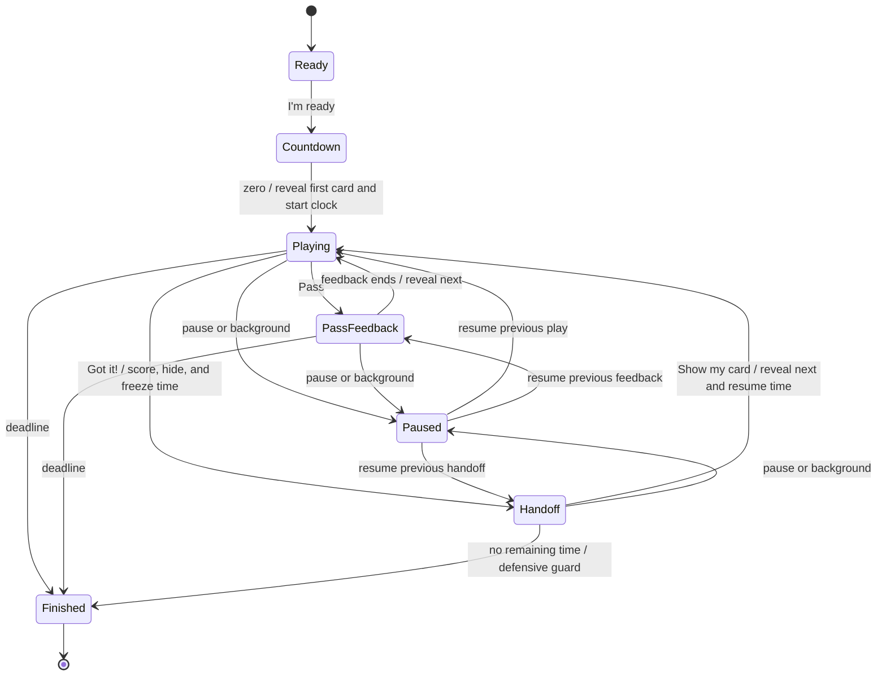

# Pass n' Play master plan

Date: October 1, 2026

Status: Product and implementation proposal. No feature code implemented.

## 1. Feature goal

Let a group play the existing decks with one person holding the phone, reading a card privately, and giving clues to everyone else. After a correct guess, the phone moves to the next clue giver. The entire round uses a portrait interface.

The deck details screen offers two modes:

| Classic | Pass n' Play |
| --- | --- |
| One guesser, multiple clue-givers | Multiple guessers, one clue-giver |
| Hold the phone at your forehead | Hold the phone facing you |

Both modes use the same deck content, access rules, and round-length picker.

### Requested requirements

- Two selectable mode blocks on deck details, side by side where space allows.
- Portrait Get Ready, 3–2–1, and answer-card screens for Pass n' Play.
- Reveal the first card when the initial countdown reaches zero.
- A Pass button lets the current clue giver skip cards without handing over the phone.
- A correct guess gives the group time to pass the phone before revealing another card.
- Reuse the existing portrait Time's Up design.

### Recommended defaults to validate

- Use an explicit hidden-card handoff with a reveal button for the next player.
- Pause the timer during the phone handoff, from Got it! until the next player taps Show my card. The user confirmed this behavior on October 1, 2026.
- Score the group together; no player setup or team assignment in the first release.
- Allow unlimited passes with no score deduction; time spent choosing is the tradeoff.
- Launch this mode without video recording or camera-based handoffs. This is a proposed scope choice, not a requirement from the original request.
- Default new installations to Classic; remember the last selected mode. Replay preserves the completed round's mode.

## 2. Recommended handoff

**Got it! → Pass the phone → Show my card**

1. The clue giver sees the current answer and gives clues.
2. If the group guesses it, the clue giver taps **Got it!**.
3. The answer disappears immediately. The round records one correct answer.
4. A portrait handoff screen says **Pass the phone**, with the instruction **Next player: hold the phone facing you, then tap below.**
5. The next player taps **Show my card** to reveal the next answer.
6. That player becomes the clue giver. Repeat until time expires.

This gives the recipient control over when the next answer appears. There is no repeated 3–2–1 between players and no fixed waiting period.

On the answer screen, keep a small persistent explanation: **Guessed it? Tap Got it!, then pass the phone.** On Pass, show **Same player, new card** briefly so skipping and handing over remain distinct.

### Alternatives considered

| Approach | Benefit | Tradeoff | Recommendation |
| --- | --- | --- | --- |
| Hidden handoff + recipient reveal | Flexible passing speed; clear scoring moment; no permissions | Two taps across two players | First release |
| Recipient taps “Next turn” on the old answer | Only one tap per successful turn | Old answer remains visible; scoring and passing are ambiguous | Optional prototype for comparison |
| Automatic reveal after a short timer | No recipient tap | Can reveal while the phone is still moving or make quick groups wait | Avoid as the default |
| Detect a new face | Potentially hands-free | Requires separate feasibility work and reliable fallback | Later experiment |
| Hold to reveal | Card can remain hidden while the phone moves | Continuous touch adds fatigue and accessibility friction | Consider only if playtests expose a need |

Camera availability alone does not establish that a different person is holding the phone. Occlusion, multiple faces, changing angles, and the same person looking away all need evaluation. The project currently uses Vision Camera; Expo Camera documentation is not evidence of a ready-made person-change detector in this app. Any future prototype must retain manual reveal, work when permission is denied, and measure false reveals before becoming an option.

## 3. Screen and copy specification

### Deck details

Place **HOW TO PLAY** and the two mode blocks between the deck header and round length. Use a selected border, checkmark, and accessible selected state; color alone is insufficient. The entire block is tappable.

- **Classic:** “One guesser, multiple clue-givers.”
- **Pass n' Play:** “Multiple guessers, one clue-giver.”
- Selected Pass n' Play helper: “Give clues, get a guess, then pass the phone.”

Use two equal-width columns when both descriptions fit comfortably. Stack vertically on narrow screens or at larger text sizes. Preserve the visible start action and allow the setup content to scroll. Freeze selection while starting a round.

### Portrait Get Ready

- Title: **GET READY**.
- Main instruction: **First player: hold the phone facing you.**
- Supporting copy: **Keep the answer hidden. Give clues to everyone else.**
- Button: **I'm ready**.

After this button, use the familiar get-ready beat and initial countdown. This replaces Classic's forehead-position gate with an explicit readiness action. Time on this screen does not consume round time.

### Portrait countdown

Use a large centered **3**, **2**, **1**, the deck identity, and the hint **Only the clue giver should see the screen.** Reuse existing countdown sounds and appropriate haptics. Reveal the first card at zero and start the round clock once, as part of that transition.

### Portrait answer card

- Top: remaining time and a clearly separated pause control.
- Center: deck-styled answer card with large, wrapping text and optional byline.
- Bottom: secondary **Pass** and primary **Got it!** actions, comfortably reachable with either hand.
- Brief instruction below or above the controls explaining what Got it! does.

Use the current theme, deck identity, and answer typography as the visual starting point. Design for long answers and large text rather than rotating the landscape card. Avoid full-screen tap targets that trigger during a grip change. Keep controls at least 48 logical pixels high, with space between them.

### Portrait handoff

- Small success acknowledgement: **Got it!** with a checkmark.
- Main instruction: **Pass the phone**.
- Supporting copy: **Next player: hold the phone facing you, then tap below.**
- Primary button: **Show my card**.
- Timer stays visible at its frozen value, with **Timer paused** as a small hint.

Remove answer content from the visible and accessibility trees during handoff. Do not announce or preload the next answer into accessible text. Position the reveal action differently from Got it! and require a fresh touch after the previous touch ends. Add only a short input guard if physical testing shows accidental double taps; do not turn it into a mandatory handoff countdown.

### Time's Up and results

Reuse the existing portrait Time's Up visual, including the established audio/end beat. Make its completion flow work without recording. Results show the mode, group correct count, passed cards, and any actually revealed unanswered card. **Play again** retains deck, duration, and mode.

The current portrait end design lives inside the game screen's portrait-pause branches, so reuse may require extracting its presentation from that lifecycle.

## 4. Round rules and edge cases

| Event | Expected behavior |
| --- | --- |
| Pass | Record one passed answer; brief feedback; show the next card to the same holder |
| Got it! | Record one correct answer; hide it; freeze remaining time; enter handoff without revealing another card |
| Show my card | Advance/reveal once; resume the clock from the frozen remaining time |
| Time expires on an answer | Hide answer; record it as unanswered; show Time's Up |
| Handoff begins with no remaining time | Show Time's Up instead; do not create an unanswered result for an unseen card |
| Time expires during pass feedback | Keep the passed result; do not reveal another card |
| Repeated or stale taps | Ignore invalid transitions and duplicate actions |
| Action arrives at/after deadline | Expiry wins; do not add a late correct/pass or reveal |
| Manual pause or app background | Hide card, freeze remaining time, remember the exact phase |
| Resume from a visible card | Keep a cover until explicit Resume; reveal the same answer and resume time together |
| Resume from handoff | Return to handoff; recipient must still tap Show my card |
| Resume from pass feedback | Complete the pending pass transition once, with no duplicate result |
| Phone is tilted or turned sideways | Keep portrait presentation; do not score or pause based on posture |
| Empty/unavailable deck | Prevent start and show a useful message |
| Card pool is exhausted | Follow the existing replenishment policy; finish cleanly if no card is available |
| Exit during setup/round | Cancel pending work; use existing exit conventions; never navigate later from a stale callback |

Use one group score: +1 per correct answer, no penalty for Pass, and no named players or turn ownership to maintain. Use existing duration choices initially.

Pause time from Got it! until Show my card so people can pass the phone comfortably. Handoff has no time limit. Card-skipping with Pass continues consuming time, including its brief feedback. Use this as the launch behavior without an additional timer-policy setup toggle.

The app can hide answers during transitions, but players still need to keep the screen facing the clue giver during active play. Screen-reader users should use private audio where needed; announce interface state without automatically speaking secret answers to the room.

## 5. Current implementation findings

Reviewed against the repository on October 1, 2026:

| Area | Existing behavior and planned change |
| --- | --- |
| `src/app/deck/[deckId].tsx` | Owns duration, permission requests, configureRound, and ready navigation. Add mode choice and mode-specific setup. |
| `src/app/ready.tsx` | Combines forehead detection, sound/recording preparation, countdown, and landscape presentation. Separate mode-specific readiness and presentation. |
| `src/app/game.tsx` | Owns tilt input, feedback, posture pause, timer, recording, and end flow. Keep Classic behavior in a dedicated component and add a portrait Pass n' Play component. |
| `src/app/_layout.tsx` | Ready/game routes already specify portrait. Review transition behavior; a global orientation redesign is unnecessary. |
| `src/components/landscape-viewport.tsx` | Rotates Classic content 90 degrees on native. Pass n' Play must bypass this wrapper. |
| `src/game/game-types.ts`, `game-reducer.ts` | Have playing/feedback/paused/finished, but no mode or handoff phase. Extend transitions explicitly. |
| `src/game/round-context.tsx` | Owns configuration, deck snapshot, card memory, advancement, and recording. Carry mode through all entry points and gate mode-specific side effects. |
| `src/game/round-result-snapshot.ts` | Snapshot version 1 has no mode. Add backward-compatible mode metadata and update readers/validators. |
| `src/app/results.tsx` | Current replay configures only deck and duration; archived replay routes through deck details. Both paths need mode preservation. |
| `src/storage/preferences.ts` | Existing preference pattern can hold last selected mode. |
| `src/storage/daily-card-memory.ts` | Shared content memory and replenishment can serve both modes. Remember cards when actually revealed. |
| `src/hooks/use-round-timer.ts` | Existing deadline-based timer is reusable; freeze time during handoff and rebuild the deadline on reveal. |

Two specific integration risks: the reducer currently advances feedback on resume, and Classic's manual feedback effect advances automatically. Neither behavior should accidentally reveal a card during handoff.

## 6. Technical design

### Mode and state

Add a `GameMode` value such as `classic | pass-n-play` to round configuration and state. Existing callers and stored records without mode resolve to Classic. Validate values from route parameters and storage.

Add a distinct `handoff` active phase and an explicit reveal/continue action. Keep the answered card index during handoff; advance only when the recipient reveals. This makes it easier to avoid counting or remembering an unseen card.

Suggested transition model:

Ready/countdown may remain screen-level phases as they are today; the diagram describes behavior, not a requirement to move every phase into the reducer.

Reducer guards must enforce mode, phase, and deadline, including for delayed reveal/advance callbacks. Pass the action timestamp where required. Side effects such as card memory and sounds should follow accepted transitions so rejected inputs cannot remember unseen cards or play success cues. Cancel stale feedback/countdown work on pause, exit, and finish.

Freeze remaining time when Got it! is accepted and rebuild the deadline on Show my card. Zero remaining time must finish instead of revealing. Keep this separate from user/background pause so resume cannot accidentally restart a handoff clock. Invalidate callbacks tied to the old deadline when entering handoff so a stale expiry callback cannot end the frozen round.

### Presentation boundaries

Use thin ready/game route components that choose a dedicated Classic or Pass n' Play component. Mount only the selected mode's gameplay hooks. Share focused utilities for timing, deck selection, score/results, sounds, and end presentation. Avoid creating a broad game-engine abstraction for just these two modes.

Likely new components include a mode selector, portrait ready/countdown panels, portrait answer card, handoff panel, and a reusable portrait end panel. Final filenames should follow existing kebab-case conventions. Check SDK 57 `@expo/ui` controls when implementing setup controls; preserve the app's branded game presentation and current theme.

### Permissions and recording

Recommended first-release behavior: Pass n' Play never requests motion, camera, or microphone permission and never mounts an active recording session. Gate both deck-detail setup and RoundProvider/ready preparation, including replay. Remove Classic permission notices from this mode's setup.

Recording is a separate product decision because the front camera would face the clue giver, and the phone repeatedly changes hands. If recording becomes a launch requirement, explicitly add portrait capture/export framing, handoff events, permission fallback, and replay verification to scope. Do not assume the current landscape overlay/export pipeline handles it automatically.

### Persistence and compatibility

- Store mode alongside the last selected mode preference and the active round.
- Carry it into result snapshots and all replay entry points, including archived results and settings-return restoration where applicable.
- Default missing mode to Classic; tolerate malformed preferences safely.
- Confirm how snapshot readers validate version 1 before choosing an optional-field extension or a new snapshot version. Preserve old recordings/results.
- Share card memory across modes so switching modes does not reset familiar-card avoidance.
- Keep the captured deck stable for the round even if the catalog refreshes.
- Do not add permanent result history solely for this feature if existing non-recorded rounds do not persist it.

## 7. Implementation phases

### Phase 1 — Prototype the interaction

- [ ] Create portrait mockups for setup, ready, countdown, card, handoff, and end.
- [ ] Try the full loop with a small group on a physical phone.
- [ ] Compare “Got it!” and “Guessed it!” if the first label is unclear.
- [ ] Validate paused handoffs and resumed timing; confirm people understand Pass versus passing the phone.

Exit condition: players can complete several handoffs after reading the in-app instructions, without a facilitator explaining which button to press.

### Phase 2 — Add mode and state transitions

- [ ] Add mode, defaulting existing flows to Classic.
- [ ] Add handoff and guarded reveal transitions, pause/resume handling, and deadline checks.
- [ ] Wire configuration, snapshots, preferences, card memory, and replay.
- [ ] Add targeted reducer and integration tests for the new rules.

Exit condition: tests prove that handoff neither reveals nor records the next card before recipient input, including at timer expiry.

### Phase 3 — Build setup and portrait play

- [ ] Add responsive mode blocks and selected-mode instructions.
- [ ] Split mode-specific ready/game components and permission paths.
- [ ] Build portrait ready/countdown/card/handoff UI.
- [ ] Connect existing audio/haptic patterns and portrait end/results.
- [ ] Verify mode switching and replay on the supported platforms.

Exit condition: a complete Pass n' Play round works with permissions denied and no motion input.

### Phase 4 — Verify and tune

- [ ] Run `npm run typecheck`, `npm run lint`, and `npm test`.
- [ ] Test real iOS and Android devices using the project's development build; this project includes custom native modules.
- [ ] Verify web's manual controls and responsive layout where the app supports web play.
- [ ] Check small phones, large text, long answers, reduced motion, and muted audio.
- [ ] Playtest input guards, handoff copy, pass-feedback duration, and timer pressure.
- [ ] Confirm Classic's tilt, forehead gate, manual fallback, recording, and end transitions still behave correctly.

Exit condition: the acceptance checklist below passes and physical group play has no accidental answer reveals in the tested scenarios.

## 8. Acceptance checklist

- [ ] Both modes appear on deck details with the requested descriptions.
- [ ] Side-by-side blocks fall back to stacked blocks without clipped text.
- [ ] The same eligible deck content and duration settings work in either mode.
- [ ] Pass n' Play remains portrait from setup through results.
- [ ] Countdown and first reveal occur once; round time starts with the first reveal.
- [ ] Pass records one skip and retains the current clue giver.
- [ ] Got it! records one correct answer and immediately hides answer content.
- [ ] Only a fresh Show my card action reveals the next answer during handoff.
- [ ] The clock freezes on Got it! and resumes on Show my card with the same remaining time; Pass feedback continues consuming time.
- [ ] Expiry at any active phase ends cleanly; late taps cannot score or reveal.
- [ ] Unseen cards never become unanswered results or remembered cards.
- [ ] Pause/background/foreground preserve phase and time without exposing an answer unexpectedly.
- [ ] Motion, camera, and microphone permissions are unnecessary for the proposed launch scope.
- [ ] Replay preserves mode; old saved rounds replay as Classic.
- [ ] Short/empty decks, repeated taps, long text, audio failures, and interrupted setup are handled.
- [ ] Classic gameplay and video behavior pass regression checks.

## 9. Decisions for product review

The user likes the proposed handoff and confirmed that the timer pauses while passing the phone. Review the remaining proposed defaults before implementation:

1. **Handoff:** use Got it! → Pass the phone → Show my card.
2. **Time — CONFIRMED:** pause while passing the phone, from Got it! until Show my card. Skipping a card with Pass continues consuming time.
3. **Scoring:** group correct count, unlimited skips, no individual/team setup.
4. **Recording:** omit from Pass n' Play initially; preserve Classic recording.
5. **Selection:** remember last mode, with Classic as the initial default.

Later candidates: optional teams, per-player scoring, portrait recording, and a camera-assisted handoff experiment. These should follow evidence from the basic game loop.

## 10. Documentation references

The repository declares Expo `~57.0.24`. The exact versioned SDK documentation was reviewed before preparing this plan:

- [Expo SDK 57 reference](https://docs.expo.dev/versions/v57.0.0/).
- [SDK 57 ScreenOrientation](https://docs.expo.dev/versions/v57.0.0/sdk/screen-orientation/) recommends Stack.Screen orientation for individual Router screens and distinguishes screen orientation from physical device orientation. This supports retaining the existing portrait routes while changing the rendered layout.
- [SDK 57 Camera](https://docs.expo.dev/versions/v57.0.0/sdk/camera/) is background reference only; the installed camera implementation is Vision Camera. Camera-assisted person-change detection needs its own library/API investigation before committing to an approach.
